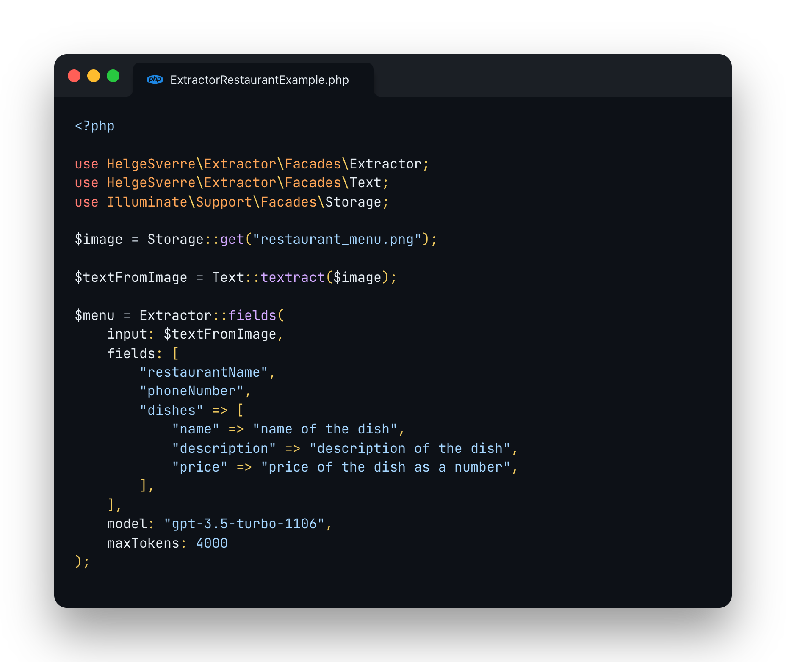

<p align="center"></p>

# Extractor: AI-Powered Data Extraction Library for Laravel.


Effortlessly extract structured data from various sources, including images, PDFs, and emails, using OpenAI within your
Laravel application.

## Features

- A convenient wrapper around OpenAI Chat and Completion endpoints.
- Supports multiple input formats such as Plain Text, PDF, Rtf, Images, Word documents and Web content.
- Includes a flexible Field Extractor that can extract any arbitrary data without writing custom logic.
- Can return a regular array or a [Spatie/data](https://spatie.be/docs/laravel-data/v3/introduction) object.
- Integrates with [Textract](https://aws.amazon.com/textract/) for OCR functionality.
- Uses [JSON Mode](https://platform.openai.com/docs/guides/text-generation/json-mode) from the latest GPT-3.5 and GPT-4
  models.

## Example

<p align="center"></p>

<details>
<summary>Example code</summary>

```php
<?php

use HelgeSverre\Extractor\Facades\Extractor;
use HelgeSverre\Extractor\Facades\Text;
use Illuminate\Support\Facades\Storage;

$image = Storage::get("restaurant_menu.png")

// Extract text from images
$textFromImage = Text::textract($image);

// Extract structured data from plain text
$menu = Extractor::fields($textFromImage,
    fields: [
        'restaurantName',
        'phoneNumber',
        'dishes' => [
            'name' => 'name of the dish',
            'description' => 'description of the dish',
            'price' => 'price of the dish as a number',
        ],
    ],
    model: "gpt-3.5-turbo-1106",
    maxTokens: 4000,
);
```

</details>

## Installation

Install the package via composer:

```bash
composer require helgesverre/extractor
```

Publish the configuration file:

```bash
php artisan vendor:publish --tag="extractor-config"
```

You can find all the configuration options in the [configuration file](/config/extractor.php).

Since this package relies on the [OpenAI Laravel Package](https://github.com/openai-php/laravel), you also need to
publish their configuration and add the `OPENAI_API_KEY` to your `.env` file:

```shell
php artisan vendor:publish --provider="OpenAI\Laravel\ServiceProvider"
```

```dotenv
OPENAI_API_KEY="your-key-here"

# Optional: Set request timeout (default: 30s).
OPENAI_REQUEST_TIMEOUT=60
```

## Usage

### Extracting plain text from documents

```php
use HelgeSverre\Extractor\Facades\Text;

$textPlainText = Text::text(file_get_contents('./data.txt'));
$textPdf = Text::pdf(file_get_contents('./data.pdf'));
$textImageOcr = Text::textract(file_get_contents('./data.jpg'));
$textPdfOcr = Text::textractUsingS3Upload(file_get_contents('./data.pdf'));
$textWord = Text::word(file_get_contents('./data.doc'));
$textWeb = Text::web('https://example.com');
$textHtml = Text::html(file_get_contents('./data.html'));
```

| Description                                                                                                                                                                                                   | Method                        |
|---------------------------------------------------------------------------------------------------------------------------------------------------------------------------------------------------------------|-------------------------------|
| Extract text from a plain text, useful if you need trim/normalize whitespace in a string.                                                                                                                     | `Text::text`                  |
| Extract text from a PDF file, uses [smalot/pdfparser](https://github.com/smalot/pdfparser)                                                                                                                    | `Text::pdf`                   |
| Extract text with [AWS Textract](https://aws.amazon.com/textract/) by sending the content as a base64 encoded string (faster, but has [limitations](https://docs.aws.amazon.com/textract/latest/dg/sync.html) | `Text::textract`              |
| Extract text with [AWS Textract](https://aws.amazon.com/textract/) by uploading file to S3 and polling for completion (handles larger files and multi-page PDFs)                                              | `Text::textractUsingS3Upload` | 
| Extract plain text from a Word document (Uses simple xml parsing and unzipping)                                                                                                                               | `Text::word`                  |
| Fetches HTML from an URL via HTTP, strip all HTML tags, squish and trim all whitespace.                                                                                                                       | `Text::web`                   |
| Extract text from an HTML file (same, but for HTML content)                                                                                                                                                   | `Text::html`                  |

## Extracting structured data

The `Extractor` package includes a set of pre-built extractors designed to simplify the extraction of structured data
from various types of text. Each extractor is optimized for specific data formats, making it easy to process different
types of information. Below is a list of the included extractors along with brief descriptions and convenient shortened
methods for each:

| Example                                                          | Extractor | Description                                                                                                         |
|------------------------------------------------------------------|-----------|---------------------------------------------------------------------------------------------------------------------|
| `Extractor::extract(Contacts::class, $text);`                    | Contacts  | Extracts a list of contacts (name, title, email, phone).                                                            |
| `Extractor::extract(Receipt::class, $text);`                     | Receipt   | Extracts common Receipt data, See [receipt-scanner](https://github.com/HelgeSverre/receipt-scanner) for details.    |
| `Extractor::fields($text, fields: ["name","address", "phone"]);` | Fields    | Extracts arbitrary fields provided as an array of output key, and optional description, also supports nested fields |

These extractors are provided out of the box and offer a convenient way to extract specific types of structured data
from text. You can use the shortened methods to easily access the functionality of each extractor.

## Using the Field extractor

The field extractor is great if you don't need much custom logic or validation and just want to extract out some
structured data from a piece of text.

Here is an example of extracting information from a CV, note that providing a description to guide the AI model is
supported, as well as nested items (which is useful for lists of sub-items, like work history, line items, comments on a
product etc )

```php
$sample = Text::pdf(file_get_contents(__DIR__.'/../samples/helge-cv.pdf'));

$data = Extractor::fields($sample,
    fields: [
        'name' => 'the name of the candidate',
        'email',
        'certifications' => 'list of certifications, if any',
        'workHistory' => [
            'companyName',
            'from' => 'Y-m-d if available, Year only if not, null if missing',
            'to' => 'Y-m-d if available, Year only if not, null if missing',
            'text',
        ],
    ],
    model: Engine::GPT_3_TURBO_1106,
);
```

## Using GPT-4-Vision with Extractor

**Note**: This feature is still WIP.

The `Extractor` package also integrates with OpenAI's new Vision API, leveraging the powerful `gpt-4o`
model to extract
structured data from images. This feature enables you to analyze and interpret visual content with ease, whether it's
reading text from images, extracting data from charts, or understanding complex visual scenarios.

### How to Use OpenAI's Vision API with ImageContent

To use the Vision features in `Extractor`, you need to provide an image as input. This can be done in a few different
ways:

1. **Using a File Path**: Load an image from a file path.
2. **Using Raw Image Data**: Use the raw data of an image, for example, from an uploaded file.
3. **Using an Image URL**: Load an image directly from a URL.

Here's how you can use each method:

#### Using a File Path

```php
use HelgeSverre\Extractor\Text\ImageContent;

$imagePath = __DIR__ . '/../samples/sample-image.jpg';
$imageContent = ImageContent::file($imagePath);
```

#### Using Raw Image Data

```php
use HelgeSverre\Extractor\Text\ImageContent;

$rawImageData = file_get_contents(__DIR__ . '/../samples/sample-image.jpg');
$imageContent = ImageContent::raw($rawImageData);
```

#### Using an Image URL

```php
use HelgeSverre\Extractor\Text\ImageContent;

$imageUrl = 'https://example.com/sample-image.jpg';
$imageContent = ImageContent::url($imageUrl);
```

### Extracting Data from Images with OpenAI's Vision API

After preparing your `ImageContent` object, you can pass it to the `Extractor::fields` method to extract structured data
using OpenAI's Vision API. For example:

```php
use HelgeSverre\Extractor\Facades\Extractor;
use HelgeSverre\Extractor\Text\ImageContent;

$imageContent = ImageContent::file(__DIR__ . '/../samples/product-catalog.jpg');

$data = Extractor::fields(
    $imageContent,
    fields: [
        'productName',
        'price',
        'description',
    ],
    model: Engine::GPT_4_OMNI,
);
```

## Creating Custom Extractors

Custom extractors in Extractor allow for tailored data extraction to meet specific needs. Here's how you can create and
use a custom extractor, using the example of a Job Posting Extractor.

### Implementing a Custom Extractor

Create a new class for your custom extractor by extending the `Extractor` class. In this example, we'll create
a `JobPostingExtractor` to extract key information from job postings:

```php
<?php

namespace App\Extractors;

use HelgeSverre\Extractor\Extraction\Extractor;
use HelgeSverre\Extractor\Text\TextContent;

class JobPostingExtractor extends Extractor
{
    public function prompt(string|TextContent $input): string
    {
        $outputKey = $this->expectedOutputKey();

        return "Extract the following fields from the job posting below:"
            . "\n- jobTitle: The title or designation of the job."
            . "\n- companyName: The name of the company or organization posting the job."
            . "\n- location: The geographical location or workplace where the job is based."
            . "\n- jobType: The nature of employment (e.g., Full-time, Part-time, Contract)."
            . "\n- description: A brief summary or detailed description of the job."
            . "\n- applicationDeadline: The closing date for applications, if specified."
            . "\n\nThe output should be a JSON object under the key '{$outputKey}'."
            . "\n\nINPUT STARTS HERE\n\n$input\n\nOUTPUT IN JSON:\n";
    }

    public function expectedOutputKey(): string
    {
        return 'extractedData';
    }
}
```

**Note**: Adding an instruction on which `$outputKey` key to nest the data under is recommended, as the JsonMode
response from OpenAI end to want to put everything under a root key, by overriding the   `expectedOutputKey()` method,
it will tell the base Extractor class which key to pull the data from.

### Registering the Custom Extractor

After defining your custom extractor, register it with the main Extractor class using the `extend` method:

```php
use HelgeSverre\Extractor\Extractor;

Extractor::extend("job-posting", fn() => new JobPostingExtractor());
```

### Using the Custom Extractor

Once registered, you can use your custom extractor just like the built-in ones. Here's an example of how to use
the `JobPostingExtractor`:

```php
use HelgeSverre\Extractor\Facades\Text;
use HelgeSverre\Extractor\Extractor;

$jobPostingContent = Text::web("https://www.finn.no/job/fulltime/ad.html?finnkode=329443482");

$extractedData = Extractor::extract('job-posting', $jobPostingContent);
// Or you can specify the class-string instead
// ex: Extractor::extract(JobPostingExtractor::class, $jobPostingContent);

// $extractedData now contains structured information from the job posting
```

With the `JobPostingExtractor`, you can efficiently parse and extract key information from job postings, structuring it
in a way that's easy to manage and use within your Laravel application.

### Adding Validation to the Job Posting Extractor

To ensure the integrity of the extracted data, you can add validation rules to your Job Posting Extractor. This is done
by using the `HasValidation` trait and defining validation rules in the `rules` method:

```php
<?php

namespace App\Extractors;

use HelgeSverre\Extractor\Extraction\Concerns\HasValidation;
use HelgeSverre\Extractor\Extraction\Extractor;

class JobPostingExtractor extends Extractor
{
    use HasValidation;

    public function rules(): array
    {
        return [
            'jobTitle' => ['required', 'string'],
            'companyName' => ['required', 'string'],
            'location' => ['required', 'string'],
            'jobType' => ['required', 'string'],
            'salary' => ['required', 'numeric'],
            'description' => ['required', 'string'],
            'applicationDeadline' => ['required', 'date']
        ];
    }
}
```

This will ensure that each key field in the job posting data meets the specified criteria, enhancing the reliability of
your data extraction.

### Extracting Data into a DTO

Extractor can integrate with `spatie/data` to cast the extracted data into a Data Transfer Object (DTO) of your
choosing. To do this, add the `HasDto` trait to your extractor and specify the DTO class in the `dataClass` method:

```php
<?php

namespace App\Extractors;

use DateTime;
use App\Extractors\JobPostingDto;
use HelgeSverre\Extractor\Extraction\Concerns\HasDto;
use HelgeSverre\Extractor\Extraction\Extractor;
use Spatie\LaravelData\Data;

class JobPostingDto extends Data
{
    public function __construct(
        public string $jobTitle,
        public string $companyName,
        public string $location,
        public string $jobType,
        public int|float $salary,
        public string $description,
        public DateTime $applicationDeadline
    ) {
    }
}

class JobPostingExtractor extends Extractor
{
    use HasDto;

    public function dataClass(): string
    {
        return JobPostingDto::class;
    }

    public function isCollection(): bool
    {
        return false; 
    }
}
```

## OCR Configuration with AWS Textract

To use AWS Textract for extracting text from large images and multi-page PDFs,
the package needs to upload the file to S3 and pass the s3 object location along to the textract service.

So you need to configure your AWS Credentials in the `config/extractor.php` file as follows:

```dotenv
TEXTRACT_KEY="your-aws-access-key"
TEXTRACT_SECRET="your-aws-security"
TEXTRACT_REGION="your-textract-region"

# Can be omitted
TEXTRACT_VERSION="2018-06-27"
```

You also need to configure a seperate Textract disk where the files will be stored,
open your  `config/filesystems.php` configuration file and add the following:

```php
'textract' => [
    'driver' => 's3',
    'key' => env('TEXTRACT_KEY'),
    'secret' => env('TEXTRACT_SECRET'),
    'region' => env('TEXTRACT_REGION'),
    'bucket' => env('TEXTRACT_BUCKET'),
],
```

Ensure the `textract_disk` setting in `config/extractor.php` is the same as your disk name in
the `filesystems.php`
config, you can change it with the .env value `TEXTRACT_DISK`.

```php
return [
    "textract_disk" => env("TEXTRACT_DISK")
];
```

`.env`

```dotenv
TEXTRACT_DISK="uploads"
```

### Delete the files after processing them with Textract

#### Using S3 Lifecycle Rules

You can configure a lifecycle rule on your S3 bucket to delete the files after a certain amount of time, see the AWS
docs for more info:

https://repost.aws/knowledge-center/s3-empty-bucket-lifecycle-rule

#### Using the `cleanupFileUsing` hook

By default, the package will __NOT__ delete the files that has been uploaded in the textract S3 bucket, if you want to
delete these files, you can implement this using the `TextractUsingS3Upload::cleanupFileUsing(Closure)` hook.

```php
// Delete the file from the S3 bucket
TextractUsingS3Upload::cleanupFileUsing(function (string $filePath) {
    Storage::disk('textract')->delete($filePath);
}
```

**Note**

Textract is not available in all regions:

> Q: In which AWS regions is Amazon Textract available?
> Amazon Textract is currently available in the US East (Northern Virginia), US East (Ohio), US West (Oregon), US West (
> N. California), AWS GovCloud (US-West), AWS GovCloud (US-East), Canada (Central), EU (Ireland), EU (London), EU (
> Frankfurt), EU (Paris), Asia Pacific (Singapore), Asia Pacific (Sydney), Asia Pacific (Seoul), and Asia Pacific (
> Mumbai)
> Regions.

See: https://aws.amazon.com/textract/faqs/

## All Parameters and Their Functions

**`$input` (TextContent|string)**

The input text or data that needs to be processed. It accepts either a `TextContent` object or a string.

**`$model` (Model)**

This parameter specifies the OpenAI model used for the extraction process.

It accepts a `string` value. Different models have different speed/accuracy characteristics and use cases, for
convenience, most of the accepted models are provided as constants on the `Engine` class.

Available Models:

| Model Identifier               | Model                      | Note                                                                                                                                                                                           |
|--------------------------------|----------------------------|------------------------------------------------------------------------------------------------------------------------------------------------------------------------------------------------|
| `Engine::GPT_4_OMNI_MINI`      | 'gpt-4o-mini'              | Optimized version of GPT-4 with enhanced JSON mode capabilities                                                                                                                                |
| `Engine::GPT_4_OMNI`           | 'gpt-4o'                   | Enhanced GPT-4 model with improved JSON mode and vision capabilities                                                                                                                           |
| `Engine::GPT_4_TURBO`          | 'gpt-4-turbo'              | Latest GPT-4 model optimized for performance and efficiency                                                                                                                                    |
| `Engine::GPT_4_1106_PREVIEW`   | 'gpt-4-1106-preview'       | GPT-4 Turbo, featuring improved instruction following, JSON mode, reproducible outputs, parallel function calling. Maximum 4,096 output tokens. Preview model, not yet for production traffic. |
| `Engine::GPT_3_TURBO_1106`     | 'gpt-3.5-turbo-1106'       | Updated GPT-3.5 Turbo, with improvements similar to GPT-4 Turbo. Returns up to 4,096 output tokens.                                                                                            |
| `Engine::GPT_O1_MINI`          | 'o1-mini'                  | Specialized model optimized for specific tasks                                                                                                                                                 |
| `Engine::GPT_O1_PREVIEW`       | 'o1-preview'               | Preview version of the O1 model with enhanced capabilities                                                                                                                                     |
| `Engine::GPT_4`                | 'gpt-4'                    | Large multimodal model, capable of solving complex problems with greater accuracy                                                                                                              |
| `Engine::GPT4_32K`             | 'gpt-4-32k'                | Extended version of GPT-4 with a larger context window of 32,768 tokens                                                                                                                        |
| `Engine::GPT_3_TURBO_INSTRUCT` | 'gpt-3.5-turbo-instruct'   | Similar to text-davinci-003, optimized for legacy Completions endpoint                                                                                                                         |
| `Engine::GPT_3_TURBO_16K`      | 'gpt-3.5-turbo-16k'        | Extended version of GPT-3.5 Turbo, supporting a larger context window of 16,385 tokens                                                                                                         |
| `Engine::GPT_3_TURBO`          | 'gpt-3.5-turbo'            | Optimized for chat using the Chat Completions API                                                                                                                                              |
| `Engine::TEXT_DAVINCI_003`     | ~~'text-davinci-003'~~     | **DEPRECATED** - Legacy model, no longer operational                                                                                                                                           |
| `Engine::TEXT_DAVINCI_002`     | ~~'text-davinci-002'~~     | **DEPRECATED** - Legacy model, no longer operational                                                                                                                                           |
| `Engine::GPT_4_VISION`         | ~~'gpt-4-vision-preview'~~ | **DEPRECATED** Multimodal model capable of processing both text and images                                                                                                                     |

**`$maxTokens` (int)**

The maximum number of tokens that the model will process.
The default value is `2000`, and adjusting this value may be necessary for very long text. A value of 2000 is usually
sufficient.

**`$temperature` (float)**

Controls the randomness/creativity of the model's output.

A higher value (e.g., 0.8) makes the output more random, which is usually not desired in this context. A recommended
value is 0.1 or 0.2; anything over 0.5 tends to be less useful. The default is `0.1`.

## License

This package is licensed under the MIT License. For more details, refer to the [License File](LICENSE.md).
